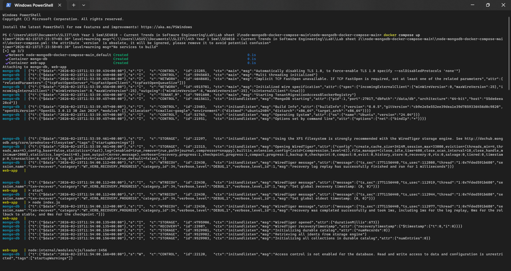
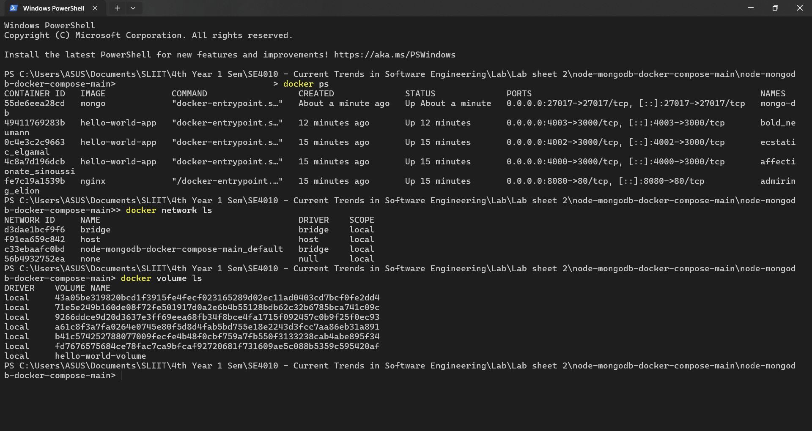
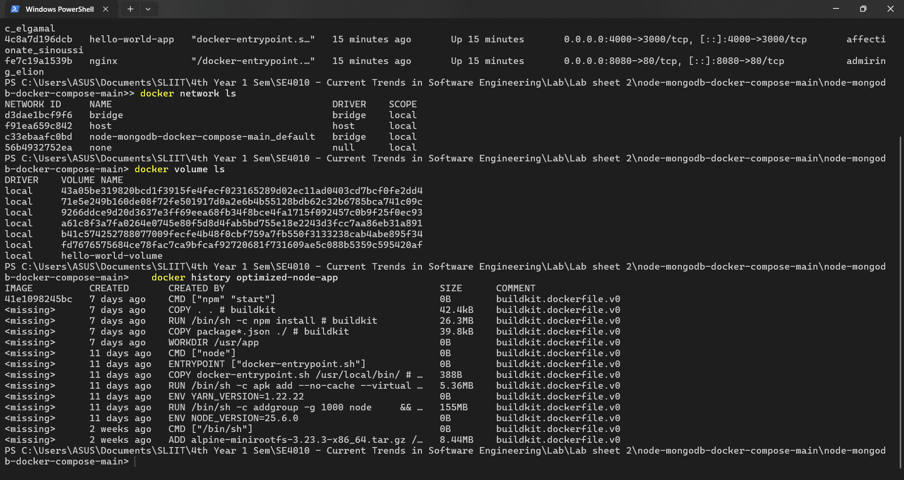

# 🚀 DevOps Lab 02: Advanced Docker & Container Orchestration
### Module: Current Trends in Software Engineering (SE4010) - 2026 

---

## 📖 Project Overview
This repository focuses on professional Docker workflows, including image distribution , multi-container orchestration using Docker Compose, and build optimization. The lab demonstrates how to manage a web application and a database as a single unit while optimizing build times through layer caching.

### ✨ Key Features
* **Docker Hub Integration**: Publishing and versioning images in a central registry.
* **Container Orchestration**: Deploying a Node.js web app and MongoDB using Docker Compose.
* **Build Optimization**: Implementing patterns to leverage Docker layer caching for faster CI/CD pipelines.
* **Network & Volume Management**: Persisting database data and managing internal container networking.

---

## 🛠 Tech Stack
| Technology | Usage |
| :--- | :--- |
| **Docker** | Containerization Platform |
| **Docker Compose** | Multi-container Orchestration  |
| **Docker Hub** | Image Registry & Distribution  |
| **Node.js** | Web Application Service  |
| **MongoDB** | NoSQL Database Service  |

---

## 📂 Project Structure
```text
/
[cite_start]├── docker-compose.yml     # Orchestration for Web & Mongo services 
[cite_start]├── Dockerfile             # Optimized build configuration 
[cite_start]├── package.json           # Node.js dependencies 
└── server.js              # Application entry point
```

## 🚀 Execution & Evidence

### 1. Multi-Container Deployment
The application is deployed using Docker Compose, which simplifies the complex process of running individual containers manually.
* **Command:** `docker compose up` 

> **Evidence:**
> 

### 2. Service Verification
Status of the running containers, including the persistent volumes and internal networks created for the application.
* **Verification Commands:** * `docker ps` (Check container status) 
    * `docker network ls` (View application networks) 
    * `docker volume ls` (View database volumes) 

> **Evidence:**
> 

### 3. Build Optimization (Docker Caching)
By copying `package.json` before the source code, we ensure that `npm install` only re-runs if dependencies change, drastically reducing CI/CD build times.
* **Optimized Step:** ```dockerfile
    COPY package*.json ./
    RUN npm install
    [cite_start]```

> **Evidence:**
> 

---

## ✍️ Student Information
* **Name:** Nithika Perera
* **IT Number:** IT22061348
* **Module:** Current Trends in Software Engineering (SE4010) 
* **Institute:** SLIIT - Faculty of Computing

---

<p align="center">
  <b>Expected Outcome:</b> Successfully optimized Docker build pipelines and orchestrated a multi-container environment with persistent storage.
</p>
