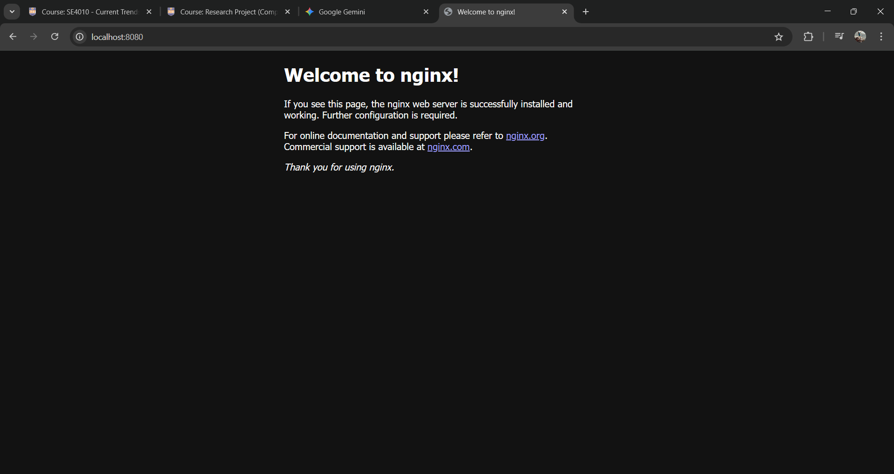
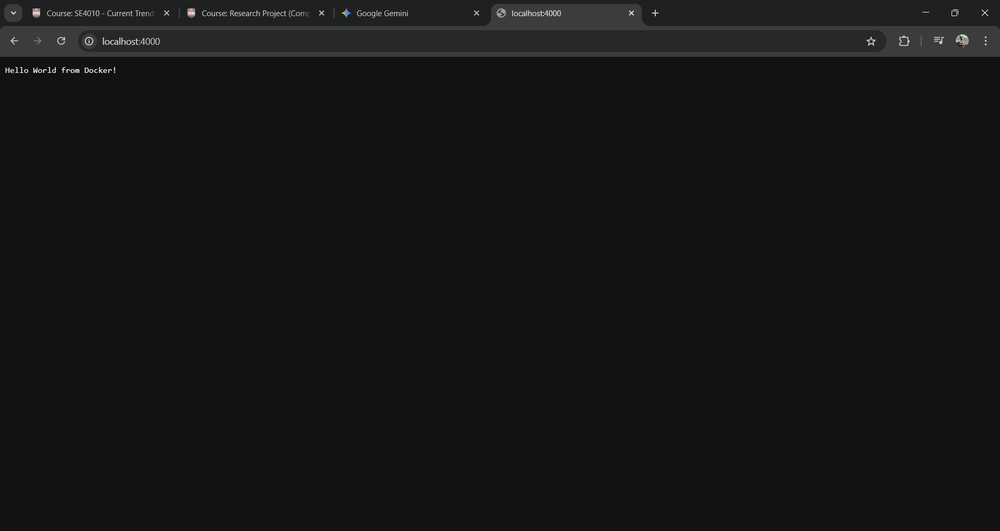
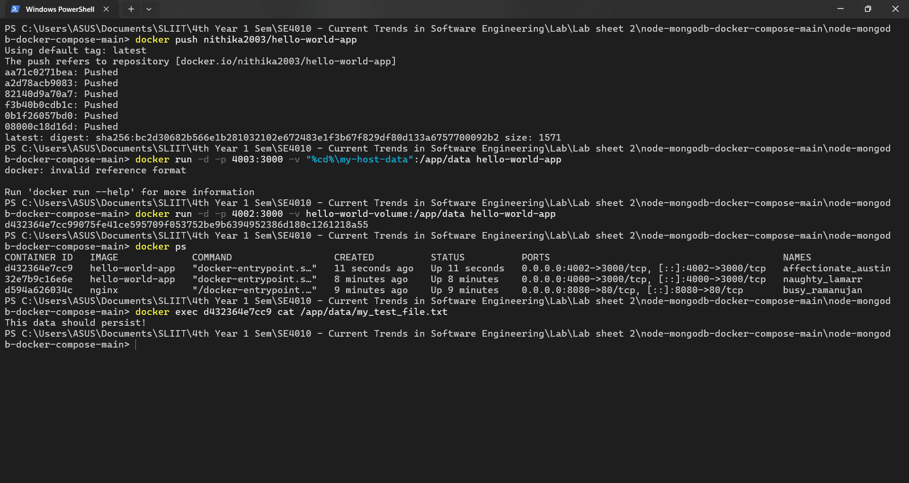
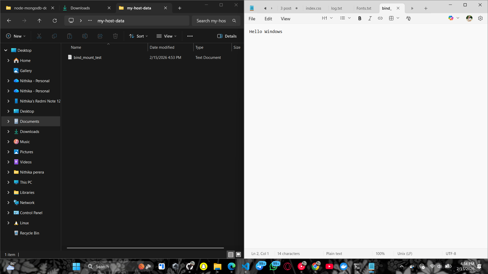

# 🚀 DevOps Lab 02: Docker Fundamentals
### Module: Current Trends in Software Engineering (SE4010) - 2026

---

## 📖 Project Overview
This repository contains the practical implementation of **Docker Fundamentals**. The lab focuses on understanding containerization by running official images, building custom Docker images for a Node.js application, and managing data persistence using Volumes and Bind Mounts.

### ✨ Key Features
* **Containerization**: Running official Nginx and custom Node.js containers.
* **Custom Images**: Building and optimizing Docker images using a `Dockerfile`.
* **Data Persistence**: Using **Docker Volumes** to persist data across container restarts.
* **Host-Container Sync**: Implementing **Bind Mounts** to share files between the host and container.
* **Docker Hub**: Tagging and pushing images to a remote repository.

---

## 🛠 Tech Stack
| Technology | Usage |
| :--- | :--- |
| **Docker Engine** | Container Runtime |
| **Node.js** | Application Runtime |
| **Docker Hub** | Image Registry |
| **Nginx** | Web Server (Task 01) |
| **Alpine Linux** | Base Image |

---

## 📂 Project Structure
```text
my-docker-app/
├── Dockerfile          # Configuration to build the image
└── index.js            # Simple Node.js Hello World application
```

## 🚀 Execution & Evidence

### 1. Running Nginx (Task 01)
Pulled and ran the official Nginx image mapping host port `8080` to container port `80`.
* **Command:** `docker run -d -p 8080:80 nginx`
* **URL:** `http://localhost:8080`

> **Evidence:**
> 
> *(Note: Replace with your actual screenshot filename)*

### 2. Custom Node.js App (Task 02)
Containerized a simple "Hello World" Node.js application and pushed it to Docker Hub.
* **Command:** `docker run -d -p 4000:3000 hello-world-app`
* **URL:** `http://localhost:4000`

> **Evidence:**
> 

### 3. Docker Volumes (Task 03)
Used Docker Volumes to ensure data persists even if the container is removed.
* **Volume Name:** `hello-world-volume`
* **Mount Point:** `/app/data`

> **Evidence:**
> 

### 4. Bind Mounts (Task 04)
Linked a host directory to the container to verify real-time file synchronization for development.
* **Host Path:** `./my-host-data`
* **Container Path:** `/app/data`

> **Evidence:**
> 

---

## 📋 Docker Commands Used
| Task | Command | Description |
| :--- | :--- | :--- |
| **Build** | `docker build -t hello-world-app .` | Build the image from Dockerfile |
| **Run** | `docker run -d -p 4000:3000 <image>` | Run container in background |
| **Volume** | `docker volume create <name>` | Create a managed volume |
| **Push** | `docker push <username>/<image>` | Upload image to Docker Hub |
| **Exec** | `docker exec -it <id> sh` | Access container shell |

---

## ✍️ Student Information
* **Name:** Nithika Perera
* **IT Number:** IT22061348
* **Module:** Current Trends in Software Engineering (SE4010)
* **Institute:** SLIIT - Faculty of Computing

---

<p align="center">
  <b>Expected Outcome:</b> Successfully demonstrated Docker image creation, container management, and data persistence strategies.
</p>
